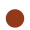
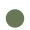
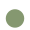
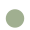
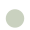
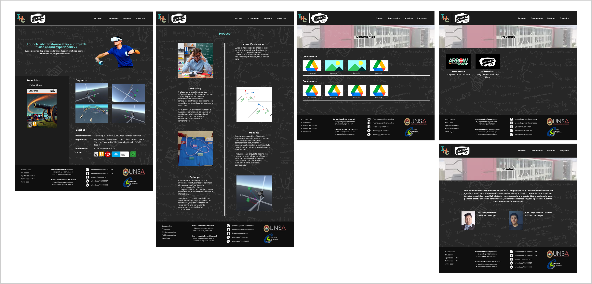
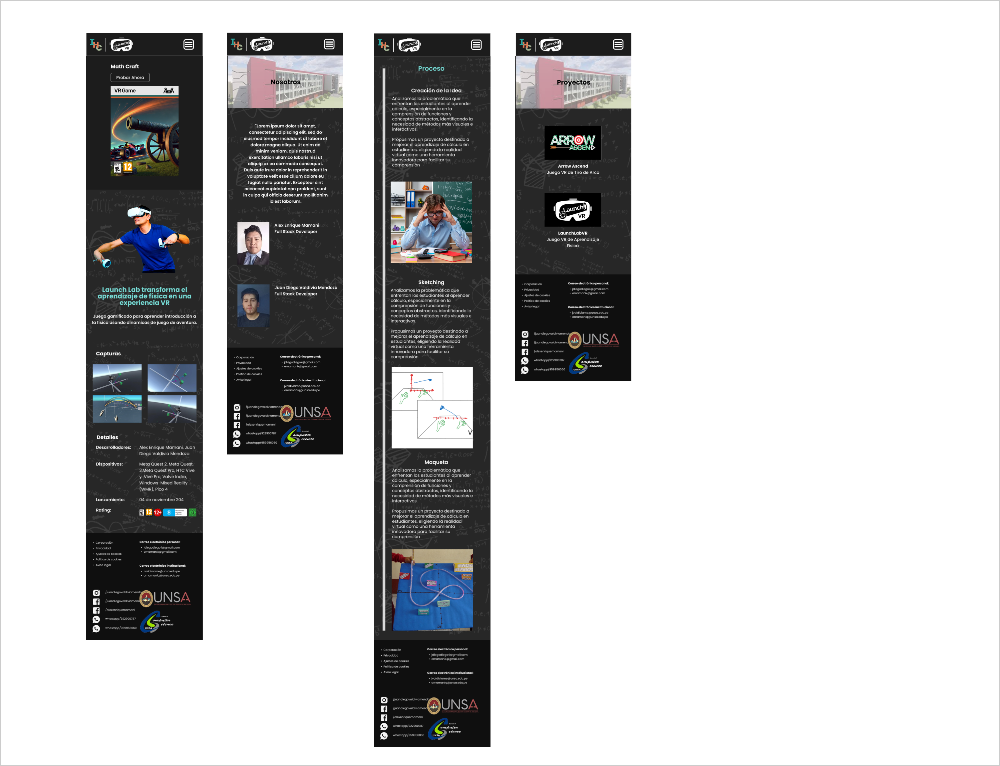

> [!IMPORTANT]
> GitHub Pages Configuration
>
> This project uses specific configuration for GitHub Pages:
>
> *   **`BrowserRouter`**: `basename="/LaunchLabVR-ArrowAscendVR-Web"`
> *   **`vite.config.js`**: `base: 'https://jd17vm.github.io/LaunchLabVR-ArrowAscendVR-Web'`
>
> To run locally, revert to:
>
> *   **`BrowserRouter`**: No `basename`
> *   **`vite.config.js`**: `base: '/'`
>
> Then, rebuild the project with Vite.

# **Launch Lab VR and Arrow Ascend Web**

---

## **Typographic System**

**Font Family:** `Poppins`

| Title | Size |
|---|---|
| Title 1 | `28px` |
| Title 2 | `22px` |
| Title 3 | `18px` |
| Title 4 | `15px` |
| Title 5 | `12px` |

## **Color palette**

| Color | Hex Code |
|---|---|
|  | `#1C1C1C` |
|  | `#686868` |
|  | `#B3B3B3` |
|  | `#DDDDDD` |
|  | `#F7F7F7` |
|  | `#913919` |
|  | `#DA5625` |
|  | `#E27C55` |
|  | `#EAA186` |
|  | `#687756` |
|  | `#859870` |
|  | `#A0AF90` |
|  | `#C9D1BF` |
|  | `#0B1420` |
|  | `#26446D` |
|  | `#6590CA` |

## **Diseño UI**

You can see the project design in Figma: [Figma UI Design](https://www.figma.com/design/d4KgvrUiG4gTi0cpru46v0/Proyecto_LaunchLAb_ArrowAscend?node-id=0-1&t=TTHmZeOvj59fl94q-1)

### **Desktop UI Design**

- Inicio
- Proceso
- Nosotros
- Proyectos
- Documentos

### **Mobile UI Design**

- Inicio
- Proceso
- Nosotros
- Proyectos

